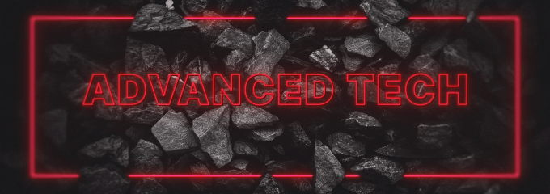

# Advanced Tech
  

Introducing AdvancedTech, an immersive add-on for the popular Minecraft plugin Slimefun. This Addon Brings Exciting New Things Like Handheld Diggers, and, New Solar Panels!

This Addon Revolves Around the Concept of a Command Hub, Where, You Will get Only 6 Positions to Place and Power Your Different Components (Basically Means You can have only 5 Different Machines (One will be taken by the Engine.))

# Wiki
The Official AdvancedTech Wiki: [Here](https://github.com/PranavVerma-droid/AdvancedTech/wiki)
Official Creator: [PranavVerma-droid](https://github.com/PranavVerma-droid)
# Dependencies
This Addon Needs the Slimefun4 Plugin.
Download it [Here](https://thebusybiscuit.github.io/builds/TheBusyBiscuit/Slimefun4/master/)

# Downloads
Addon Can Be Downloaded from The Official Download Pages:  
Download Stable: [Here](https://thebusybiscuit.github.io/builds/PranavVerma-droid/AdvancedTech/stable)  
Download Latest: [Here](https://thebusybiscuit.github.io/builds/PranavVerma-droid/AdvancedTech/dev)

You can Also Download The Latest STABLE Build from [Modrinth](https://modrinth.com/plugin/advancedtech-slimefun).
# Versions & Support

https://github.com/PranavVerma-droid/AdvancedTech/wiki#versions--support

# Contributing
To Contribute to the Project, please read the [Contributing Guidelines](.github/CONTRIBUTING.md)

<!-- DRAKES-STATUS:BEGIN -->
> Estado de sincronizacion: **2026-04-24**.
> Baseline tecnico vigente: **Paper 1.21.1 + Java 21**.
> CI principal en `main`: **Gates 1-5 en verde**.
> Nota: el monorepo completo sigue en migracion incremental por lotes.
<!-- DRAKES-STATUS:END -->

---

## 📄 License & Upstream Attribution

This project is a sovereign fork maintained by [**JackStar6677-1**](https://github.com/JackStar6677-1) under [**DrakesCraft Labs**](https://github.com/DrakesCraft-Labs).

- **Original Project:** Created by the upstream authors and the open-source community.
- **DrakesCraft Optimizations:** Modernized for Paper/Purpur 1.21.11+, Java 21, high concurrency, asynchronous safety, and exploit/duplication prevention.
- **License:** Distributed under the original **GNU General Public License v3.0 (GPLv3)** (or original upstream license). See the [LICENSE](LICENSE) file for complete terms.
